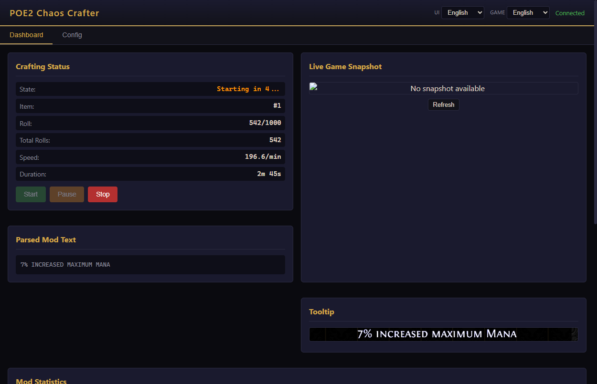
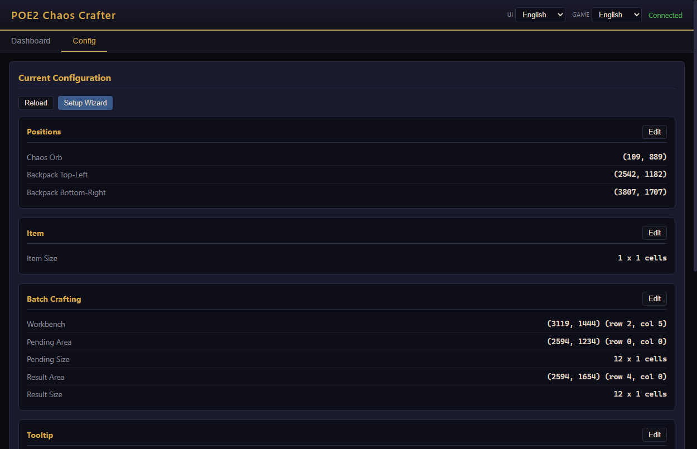
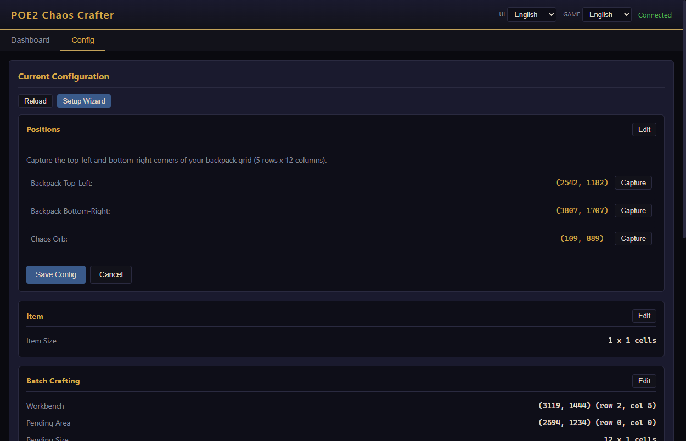
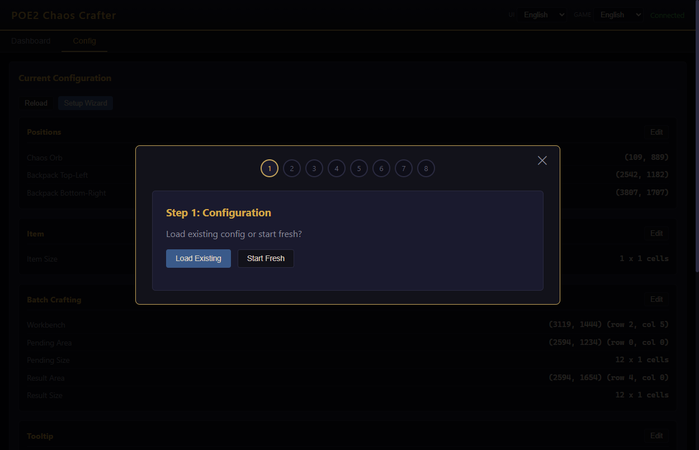

# POE2 Chaos Crafter

> Automate Chaos Orb crafting in Path of Exile 2 with OCR-powered mod detection and a browser-based GUI.

---

## Features

- **OCR mod detection** — reads item tooltips in real time using Tesseract OCR
- **Batch crafting** — process a full backpack column of items automatically (Pending → Workbench → Result)
- **Flexible mod targeting** — built-in templates for 20+ mod types, plus custom regex support
- **Browser GUI** — web interface served locally; no Electron, no separate install
- **Per-section config editing** — update any single setting (positions, mods, tooltip, etc.) without re-running the full wizard
- **Bilingual** — UI and OCR support for English and 简体中文

---

## Requirements

| Requirement | Notes |
|---|---|
| **Go 1.21+** | https://go.dev/dl/ |
| **Tesseract OCR** | https://github.com/UB-Mannheim/tesseract/wiki — install the basic package |
| **C Compiler** | Windows: MinGW-w64 or TDM-GCC (required by robotgo) |

---

## Quick Start

```bash
git clone https://github.com/yourname/POE2ChaosInoculation
cd POE2ChaosInoculation

make run-web        # build + launch web GUI  (recommended)
make run-debug      # build + launch with debug logging
make build          # compile only → poe2crafter.exe
```

Open **http://localhost:8080** in your browser.

> Web assets (`index.html`, `style.css`, `app.js`) are embedded in the binary at compile time.
> Run `make build` after any source or web file changes.

---

## Interface

### Dashboard — Live Crafting Monitor



The Dashboard shows real-time crafting state:

| Field | Description |
|---|---|
| **State** | Idle / Starting / Running / Stopped |
| **Item** | Which item in the batch is being crafted |
| **Roll** | Attempts on the current item / per-item cap |
| **Total Rolls** | Cumulative rolls this session |
| **Speed** | Rolls per minute |
| **Duration** | Elapsed session time |

The **Parsed Mod Text** panel shows the raw OCR text from the last roll. The **Tooltip** panel shows the in-game tooltip screenshot. The **Mod Statistics** table (below the fold) tracks how often each mod appears and at what values.

| Button | Action |
|---|---|
| **Start** | Begin crafting; 5-second countdown, then auto-plays |
| **Stop** | End the session |

---

### Config — Current Configuration



The Config tab shows all active settings in clearly labelled sections. Each section has an independent **Edit** button — click it to expand an inline editor for just that section without leaving the page or re-running the full wizard.

---

### Inline Section Editing



Clicking **Edit** on any section expands an inline form with the same capture workflow as the wizard:

- **Positions** — re-capture Backpack corners and Chaos Orb location
- **Item** — width & height in grid cells
- **Batch Crafting** — Workbench slot, Pending Area, Result Area
- **Tooltip** — re-capture tooltip corners + validate OCR
- **Target Mods** — add/remove mods without changing anything else
- **Options** — chaos per round, debug logging, save snapshots

Click **Save Config** to apply, or **Cancel** to discard.

---

### Setup Wizard (first-time setup)



Click **Setup Wizard** on the Config tab to open the 8-step guided modal:

| Step | What to do |
|---|---|
| **1 — Config** | Load an existing config file or start fresh |
| **2 — Backpack Grid** | Capture the top-left and bottom-right cells of your backpack |
| **3 — Chaos Orb** | Hover over a Chaos Orb in your stash and capture its position |
| **4 — Item Dimensions** | Set how many grid cells wide and tall the item is (e.g. 2×3) |
| **5 — Batch Areas** | Define Workbench, Pending Area, and Result Area grid positions |
| **6 — Tooltip Area** | Capture the tooltip corners, then click **Validate OCR** |
| **7 — Target Mods** | Add mods via the quick-template dropdown or enter custom regex |
| **8 — Review & Save** | Review all settings, then **Save Config** or **Save & Start** |

> **Capture countdown:** Clicking any Capture button gives you a 5-second on-screen countdown to switch to the game and position your cursor.

---

## Target Mod Reference

Use these keywords in the **Target Mods** section:

```
life <min>         → +X to Maximum Life
mana <min>         → +X to Maximum Mana
str <min>          → +X to Strength
dex <min>          → +X to Dexterity
int <min>          → +X to Intelligence
spirit <min>       → +X to Spirit
fire-res <min>     → X% Fire Resistance
cold-res <min>     → X% Cold Resistance
light-res <min>    → X% Lightning Resistance
chaos-res <min>    → X% Chaos Resistance
armor <min>        → X Armour
evasion <min>      → X Evasion
es <min>           → +X to Maximum Energy Shield
movespeed <min>    → X% Movement Speed
attackspeed <min>  → X% Attack Speed
castspeed <min>    → X% Cast Speed
crit-dmg <min>     → X% Critical Damage Bonus
spell-level <n>    → +N to Level of all Spell Skills
proj-level <n>     → +N to Level of all Projectile Skills
```

**Examples:**
```
life 80            → accept items with Life ≥ 80
fire-res 35        → accept items with Fire Res ≥ 35%
```

Multiple mods = **ALL** must be present on the same item.

---

## Batch Crafting Layout

```
┌──────────────────────────── Backpack (5×12) ─────────────────────────────┐
│  [Workbench]  [·][·][·]  [Pending Area  ···]  [Result Area  ···]         │
│  [ row 2 ]    [·][·][·]  [items to craft]     [successful items]         │
│  [ col 5 ]    [·][·][·]  [              ]     [                ]         │
└──────────────────────────────────────────────────────────────────────────┘
```

- **Workbench** — the single grid cell where the current item sits while being crafted
- **Pending Area** — items queued for crafting; bot picks them one at a time
- **Result Area** — items that matched all target mods are moved here automatically

---

## Config File

```
Windows:  C:\Users\<you>\.poe2_crafter_config.json
Linux:    ~/.poe2_crafter_config.json
macOS:    ~/.poe2_crafter_config.json
```

Back this file up after a successful setup. Use **Load Existing** in the wizard to restore it.

---

## Troubleshooting

| Symptom | Fix |
|---|---|
| OCR not detecting mods | Re-capture tooltip corners; run **Validate OCR** in the Tooltip section |
| Wrong positions after resolution change | Re-capture Backpack TL/BR in the Positions section |
| Items not moving to result area | Check Batch Crafting row/col values match the actual backpack layout |
| Web UI not loading | Rebuild with `make run-web` — web files are embedded at compile time |
| Chinese text not recognized | Set the **Game** language selector to 简体中文 before capturing the tooltip |

Enable **OCR Debug Logging** (Options section) to write per-roll screenshots to the `snapshots/` folder.

---

> **Disclaimer:** Automation tools may violate the Path of Exile 2 Terms of Service. Use at your own risk. This project is for educational purposes only.
